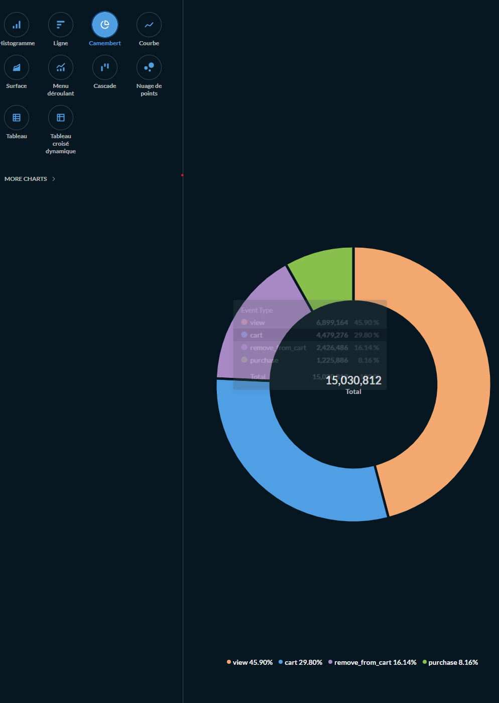
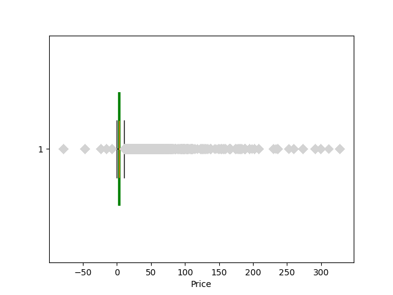
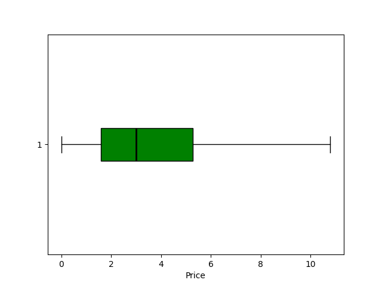

# Data Visualization – Training Piscine Data Science

## Project Overview

This project focuses on **data visualization** and **analysis**.

The goal is to explore and analyze the data stored in the *Data Warehouse* created in the [previous module](../Data_Wharehouse/README.md), and to transform raw data into **clear visual insights** using charts and statistical analysis.

Through this project, you will learn how to:

- Explore datasets
- Clean and filter relevant information
- Create visualizations to understand customer behavior
- Perform statistical analysis
- Apply clustering techniques to segment customers

---

## Project Structure

## Data Source
All exercises must use the Data Warehouse

⚠️ Important:
All visualizations must be recomputed including the February data, even if earlier graphs were created without it.

--- 

## Exercises:


### Exercise 00 – American Apple Pie

##### Goal

Create a pie chart showing what users do on the website.

#### Requirements

- Connect to the *** Data Warehouse***
- Use the `event_type` column
- Visualize the distribution of events (for example: view, cart, purchase)

The chart should help understand user behavior on the site.

### Approach

## Software
Trying with an software

```SQL
SELECT 
    event_type,
    COUNT(*) AS cnt
FROM customers
GROUP BY event_type
ORDER BY cnt DESC;
```

| event_type | total |
|-----|-----|
|view	| 6899164 |
|cart	| 4479276 |
|remove_from_cart	| 2426486 |
|purchase	| 1225886 |

---

``dbeaver community can't show chart``

so I will use **Metabase** to visualize.

```bash
docker run -d -p 3000:3000 --name metabase metabase/metabase
```

On your web broser ``http://localhost:3000``

1 . Fill the information
on the 3rd step : 
| Param: | value |
|:------:| ----------- |
| Host: | host.docker.internal |
| Port: | 5432 |
| Database: | piscineds |
| User: | your_login |
| Password: | mysecretpassword |

2 . Go to your customers table :

- click on *New*
- Create a question
- in *data* select **customers**
- in *filter* select **Event_type** 
- in *Summarize* select **Count of rows**
- in *Group by* → **event_type**
- Click on  Visualization
- Click on  Visualization → an Pie



it's not really the pie_chart of the subject.

let's try with python

### Python


### Exercise 01 – Initial Data Exploration

##### Goal

Analyze purchase data over time.

#### Requirements

 - Keep only rows where:

 ``event_type = 'purchase'``

- All prices are in *Altairian Dollars  ₳*

Create **three charts** using data from:

``October 2022 → February 2023
``


to show the month in xaxis: 
```py
plt.gca().xaxis.set_major_formatter(mdates.DateFormatter('%b'))
```

--- 

### Exercise 02 – My Beautiful Mustache

##### Goal

Perform statistical analysis on purchased item prices.

You must compute:

 - count
 - mean
 - median
 - minimum
 - maximum
 - first quartile (Q1)
 - second quartile (Q2 / median)
 - third quartile (Q3)

``Example output:``
| key | value |
| ---- | ---- |
| count | 741644 |
| mean | 5.575068 |
| std | 10.264594 |
| min | -79.370000 |
| 25% | 1.590000 |
| 50% | 3.330000 |
| 75% | 6.030000 |
| max | 327.780000 |


std = Standard deviation
[σ=square(average((v−μ)2 for v∈values)) where μ=average(values).](https://en.wikipedia.org/wiki/Standard_deviation)

https://fr.wikipedia.org/wiki/Boîte_à_moustaches
```
 Q1-1.5IQR   Q1   median  Q3   Q3+1.5IQR
                  |-----:-----|
  o      |--------|     :     |--------|    o  o
                  |-----:-----|
flier             <----------->           fliers
                       IQR
```
**Visualizations**

You must create box plots showing:

1. Distribution of item prices
2. Average basket price per user

These visualizations help detect:

- price distribution
- outliers
- purchasing patterns



that show all the price, with extrem
 - min
 - Q1
 - med
 - Q 3
 - outliers


it's use to :
- see "normal" price
- avoid the outlier to see beter

![Warning]
```
data < IQR=Q3−Q1 OR data > Q3+1,5×IQR are aberrant
```
### Exercise 03 – Highest Building

##### Goal

Create bar charts analyzing customer activity.

Required charts

1. Number of orders according to purchase frequency

frequency = nb purchase
customers = id_client

2. Total amount spent on the site by customers
(in Altairian Dollars)
amout spend = sum(price)

These charts help identify high-value customers.

--- 


### Exercise 04 – Elbow

##### Goal

[def](https://en.wikipedia.org/wiki/Elbow_method_(clustering)#:~:text=In%20cluster%20analysis%2C%20the%20elbow,number%20of%20clusters%20to%20use.)
Determine the optimal number of customer clusters.

Your boss wants to segment customers for marketing campaigns.

**Task**

K-Means
Use the Elbow Method to determine the optimal number of clusters.


- generate the elbow curve
- identify the best number of clusters
- explain your reasoning

--- 

### Exercise 05 – Clustering

##### Goal

Create customer segments using clustering algorithms.

### Requirements

Use a clustering algorithm such as:

- Hierarchical Clustering
- DBSCAN

Create at least 4 customer groups, for example:

|customers groups| mean |
|----- |----|
| New customers  |  |
| Inactive customers |  |
| Loyal customers | |
| Silver customers | |
| Gold customers | |
| Platinum customers | |

### Visualization

Provide at least two graphical representations of the clusters.

Examples:

- scatter plots
- cluster visualization
- customer segmentation charts


## REF DOCUMENTATION

https://www.ibm.com/docs/fr/spss-statistics/cd?topic=python-fetchall-method


charts :
https://matplotlib.org/stable/plot_types/stats/pie.html

https://matplotlib.org/stable/api/_as_gen/matplotlib.pyplot.boxplot.html

dbeaver :
https://github.com/dbeaver/cloudbeaver/wiki/Managing-Charts

STAT SQL:
https://www.tigerdata.com/learn/understanding-percentile_cont-and-percentile_disc
https://www.youtube.com/watch?v=dSRjROkqUiY
https://towardsdatascience.com/how-to-derive-summary-statistics-using-postgresql-742f3cdc0f44/

K-mean:
https://www.w3schools.com/python/python_ml_k-means.asp

Clustering Algorithms: 
https://scikit-learn.org/stable/modules/clustering.html
https://en.wikipedia.org/wiki/Cluster_analysis